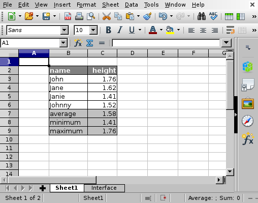

# SpreadScript: Use a spreadsheet as a function
This project provides a way to use spreadsheets from the command line or from
Python programs.

The inputs and outputs are defined by two tables in a new sheet named
"Interface". SpreadScript will read the input variables from column `B` and the
values from column `C`. Likewise, the output variables are read from column `E`
and their values from column `F`. In both cases, the variables are read from
row `4` onward until an empty cell is encountered.


## Installation
Prerequisites:

    apt install python3-uno

Via [PyPI](https://pypi.python.org/pypi/spreadscript):

    pip3 install spreadscript

From source:

    git clone https://github.com/jfjlaros/spreadscript.git
    cd spreadscript
    pip3 install .


## Usage
Suppose we have the following table.



If we want to define `a` and `b` as input variables and `total` as the output
variable, we first add a new sheet named "Interface".


In this sheet we put the input variables in column `B` and the values in column
`C`. In `Sheet1`, we now replace the value of `C3` to `=$Interface.C4` and the
value of `C4` to `=$Interface.C5`.

Likewise, the output variables are put in column `E` and the value is put in
column `F`. In this example, the value in `F4` is `=$Sheet1.C8`.

### Command line interface
With the command line interface, the input and output table can be read.

    $ spreadscript read_input data/test.ods
    {"b": 2.0, "a": 1.0}

    $ spreadscript read_output data/test.ods
    {"total": 15.0}

To manipulate the input, use the `process` subcommand:

    $ spreadscript process data/test.ods '{"b": 12.0}'
    {"total": 25.0}


### Library
First import the `SpreadScript` class and load a spreadsheet.

```python
>>> from spreadscript import SpreadScript
>>>
>>> spreadsheet = SpreadScript('data/test.ods')
```

The input variables can be read with the `read_input` method.

```python
>>> spreadsheet.read_input()
{'b': 2.0, 'a': 1.0}
```

The `read_output` method returns all output variables.

```python
>>> spreadsheet.read_output()
{'total': 15.0}
```

The `write_input` method is used to update any variables. 

```python
>>> spreadsheet.write_input({'b': 4.0})
>>> spreadsheet.read_output()
{'total': 17.0}
```
