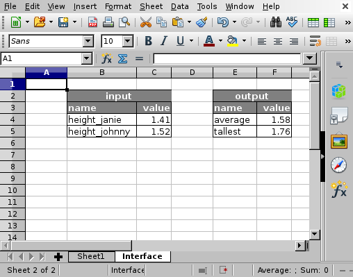

Usage
=====

Suppose we have the following table with heights of family members.

.. figure:: ../data/example_table.png
   :alt: Example table.

   Example table.

Since Janie and Johnny have not reached full height, we might want to
export their heights as input variables. Suppose we are interested in
the average height and the tallest person in this family. This
information goes to the "Interface" sheet.

   Example interface.

In this sheet we put the input variables in column ``B`` and references
to the values in column ``C``. The value of ``C4`` is ``=$Sheet1.C5``
and that of ``C5`` is ``=$Sheet1.C6``.

Likewise, the output variables are put in column ``E`` and references to
the values in column ``F``. The value of ``F4`` is ``=$Sheet1.C7`` and
that of ``F5`` is ``=$Sheet1.C9``.

Command line interface
----------------------

With the command line interface, the input and output table can be read.

::

    $ spreadscript read_input data/test.ods
    {"height_janie": 1.41, "height_johnny": 1.52}

    $ spreadscript read_output data/test.ods
    {"tallest": 1.76, "average": 1.5775}

To manipulate the input, use the ``process`` subcommand:

::

    $ spreadscript process data/test.ods  '{"height_johnny": 1.56}'
    {"tallest": 1.76, "average": 1.5875}
